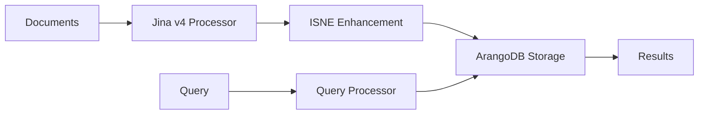

# HADES Architecture

## System Overview

HADES is a streamlined RAG system built on two core components:



## Component Architecture

### 1. Jina v4 Processor

The Jina v4 processor handles all document processing tasks in a unified pipeline:

```python
JinaV4Processor
├── Document Parsing
│   ├── Multimodal Support (text, images, code)
│   ├── Format Detection
│   ├── Metadata Extraction
│   └── AST Analysis (for code files)
│       ├── Symbol Extraction
│       ├── Import Tracking
│       └── Call Graph Generation
├── Embedding Generation
│   ├── Single-vector Mode
│   ├── Multi-vector Mode
│   └── Task-specific LoRA Adapters
├── Late Chunking
│   ├── Semantic Boundary Detection (text)
│   ├── AST Symbol Boundaries (code)
│   ├── Overlap Management
│   └── Hierarchy Preservation
└── Keyword Extraction
    ├── Attention-based Extraction
    ├── AST-based Keywords (code)
    ├── Document-level Keywords
    └── Chunk-level Keywords
```

### 2. ISNE (Inductive Shallow Node Embedding)

ISNE provides graph-based enhancement of embeddings:

```python
ISNEProcessor
├── Graph Construction
│   ├── Node Creation
│   ├── Edge Generation
│   └── Supra-weight Calculation
├── Model Architecture
│   ├── Multi-layer GNN
│   ├── Attention Mechanisms
│   └── Hierarchical Encoding
├── Training Pipeline
│   ├── Directory-aware Sampling
│   ├── Contrastive Learning
│   └── Relationship Preservation
└── Inference
    ├── Embedding Enhancement
    ├── Query Placement
    └── Path Finding
```

### 3. Storage Layer

Unified storage using ArangoDB:

```python
StorageLayer
├── Collections
│   ├── documents (full documents)
│   ├── chunks (document chunks)
│   ├── embeddings (vector data)
│   └── queries (temporary nodes)
├── Graphs
│   ├── knowledge_graph (main graph)
│   ├── import_graph (code dependencies)
│   └── hierarchy_graph (filesystem)
└── Indexes
    ├── Vector similarity
    ├── Keyword search
    └── Path traversal
```

## Data Flow

### Ingestion Pipeline

```
1. Document Input
   ↓
2. Jina v4 Processing
   - Parse document (with Docling if needed)
   - Extract filesystem hierarchy
   - Generate embeddings
   - Perform late chunking
   - Extract keywords
   ↓
3. ISNE Enhancement
   - Build graph structure
   - Calculate supra-weights
   - Enhance embeddings
   - Create relationships
   ↓
4. Storage
   - Store documents
   - Store chunks with embeddings
   - Build graph edges
   - Update indexes
```

### Query Pipeline

```
1. Query Input
   ↓
2. Query Processing
   - Generate query embedding
   - Extract query keywords
   - Create temporary graph node
   ↓
3. ISNE Placement
   - Place query in graph space
   - Calculate distances
   - Find relevant paths
   ↓
4. Retrieval
   - Traverse paths
   - Rank by supra-weights
   - Aggregate results
   ↓
5. Response
   - Return relevant chunks
   - Include context paths
   - Provide relationship map
```

## Key Design Decisions

### 1. Unified Processing
- Single model (Jina v4) for all document processing
- Eliminates component coordination overhead
- Consistent semantic understanding

### 2. Graph-First Design
- Everything is a node (documents, chunks, queries)
- Relationships are first-class citizens
- Graph structure provides additional signal

### 3. Filesystem Awareness
- Directory structure as semantic information
- Automatic relationship inference
- Hierarchical organization preservation

### 4. Multimodal Native
- Images and text in same embedding space
- No separate pipelines for different formats
- Unified retrieval across modalities

## Configuration

### Jina v4 Configuration
```yaml
jina_v4:
  model: "jinaai/jina-embeddings-v4"
  device: "cuda:0"
  output_mode: "multi-vector"
  late_chunking:
    enabled: true
    strategy: "semantic_similarity"
  keywords:
    enabled: true
    extraction_method: "attention_based"
```

### ISNE Configuration
```yaml
isne:
  model:
    hidden_dims: [1024, 512, 256]
    num_layers: 3
  training:
    batch_size: 128
    learning_rate: 0.001
    epochs: 100
  enhancement:
    strength: 0.3
```

## API Design

### REST Endpoints
```
POST /process    - Process documents
POST /query      - Query knowledge base
POST /enhance    - Enhance embeddings
GET  /status     - System status
```

### Python API
```python
# Initialize
hades = HADESJinav4(config)

# Process documents
result = await hades.process_documents([doc1, doc2])

# Query
answers = await hades.query("How does attention work?")

# Direct component access
embeddings = await hades.jina.embed(text)
enhanced = await hades.isne.enhance(embeddings)
```

## Performance Considerations

### GPU Utilization
- Jina v4: GPU 0 for embedding generation
- ISNE: Multi-GPU for training, single GPU for inference
- Batch processing for efficiency

### Memory Management
- Streaming processing for large documents
- Chunking prevents memory overflow
- Efficient graph representations

### Scalability
- Horizontal scaling via service replication
- Graph partitioning for large datasets
- Caching for frequently accessed data